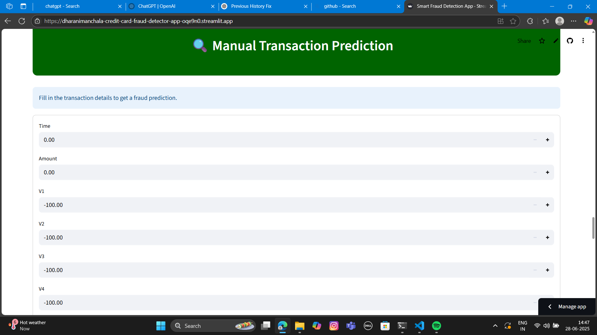
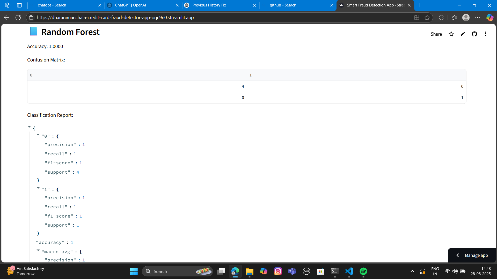
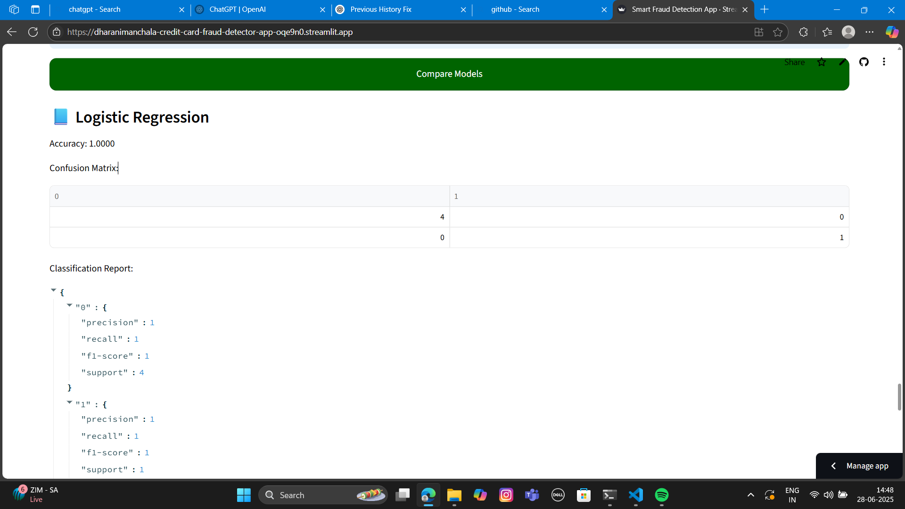
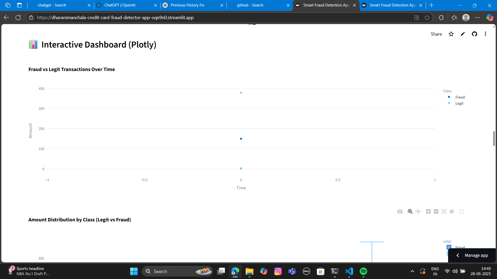

# 💳 Credit Card Fraud Detection App

An interactive and production-ready fraud detection system built with Streamlit and machine learning. It allows users to upload transaction data, identify suspicious activity, and gain actionable insights through data visualizations, all within a secure user-authenticated interface.
It’s simple, user-friendly, and offers fraud pattern insights through beautiful visualizations.

🌐 **[Live App Deployment](https://dharanimanchala-credit-card-fraud-detector-app-oqe9n0.streamlit.app/)**

---

## 🚀 Features

- 🔐 User Sign Up & Login system
- 📁 Upload CSV of transactions
- 🎯 Detect fraud using pre-trained ML model
- 🔄 Adjustable fraud threshold slider
- 📊 Visual Insights: Pie, Histogram, Heatmap, KDE
- 📄 Export Results: Download CSV + PDF Report
- 🕒 Previous uploads history view
- 🧹 Clear all history with one click
- 🔍 Manual Entry Fraud Prediction
- 📊 Interactive Dashboard
- 🤖 Model Comparison Section

---
## 🖼️ Feature Screenshots

| Home Page | File Upload |
|-----------|-------------|
|  |  |

| Options Panel | Prediction Summary |
|---------------|--------------------|
|  |  |

| Correlation Heatmap | Hourly Fraud Pattern |
|---------------------|----------------------|
|  |  |

| Log Amount Distribution | Manual Prediction |
|--------------------------|-------------------|
|  |  |

| Random Forest Visualization | Model Comparison |
|------------------------------|------------------|
|  |  |

| Interactive Dashboard |
|------------------------|
| Interactive Dashboard |
|------------------------|
|  |

## 🌍 Real-World Use Case

Credit card fraud is a critical issue for financial institutions. This app demonstrates how machine learning models can be integrated into user-facing tools to detect and prevent fraud in real-time. It’s ideal for banks, fintech startups, and fraud analytics demos.

---

## ⚙️ Tech Stack

- **Frontend**: Streamlit
- **Backend**: Python
- **ML Model**: Scikit-learn
- **Visualizations**: Matplotlib, Seaborn
- **PDF Report**: FPDF

---

## 🧠 ML Model Info

- **Dataset**: [Kaggle Credit Card Fraud Detection](https://www.kaggle.com/datasets/mlg-ulb/creditcardfraud)
- **Features**: PCA-transformed features (V1–V28), Amount, Time
- **Scaling**: StandardScaler
- **Output**: Probability + binary prediction (1 = Fraud, 0 = Legit)

---

## 🧪 How to Run Locally

git clone https://github.com/DharaniManchala/credit-card-fraud-detector.git
cd credit-card-fraud-detector
pip install -r requirements.txt
streamlit run app.py

📁 Folder Structure

credit-card-fraud-detector/
├── app.py
├── requirements.txt
├── README.md
├── model/
│   ├── fraud_model.pkl
│   └── scaler.pkl
├── history/
├── Screenshots/
│   ├── Home.png
│   ├── Browse_File.png
│   ├── options.png
│   ├── Percentage.png
│   ├── Feature_Correlation.png
│   ├── Hourly_Fraud_Pattern.png
│   └── Log_Amount_Distribution.png

## 👨‍💻 What I Implemented

- Designed a full-stack fraud detection system using Streamlit
- Trained and integrated a machine learning model using scikit-learn
- Built secure user authentication from scratch
- Developed dynamic dashboards and custom visualizations
- Enabled real-time manual fraud prediction with adjustable thresholds
- Created automated PDF reporting and result sharing features
- Deployed the app using Streamlit Cloud

## ❓ Why This Project

This project demonstrates my ability to:
- Solve real-world problems with data science
- Build end-to-end applications from model training to deployment
- Implement clean, secure, and scalable code
- Focus on user experience and usability

👤 Author
Dharani Manchala
📧 dharanimanchala48@gmail.com
🔗 GitHub: DharaniManchala
🌐 Live App

⭐ If you like this project, give it a star on GitHub!

---

