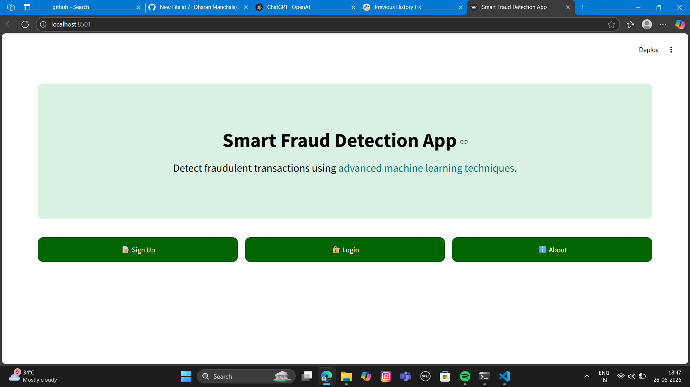
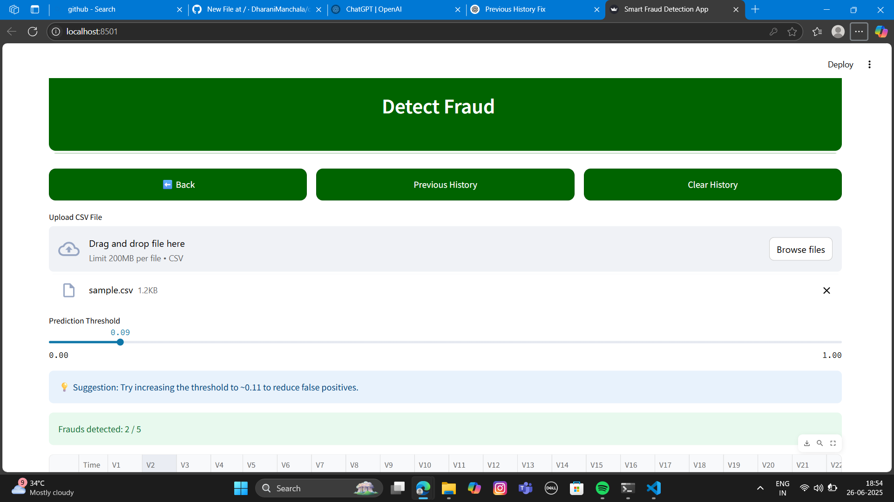
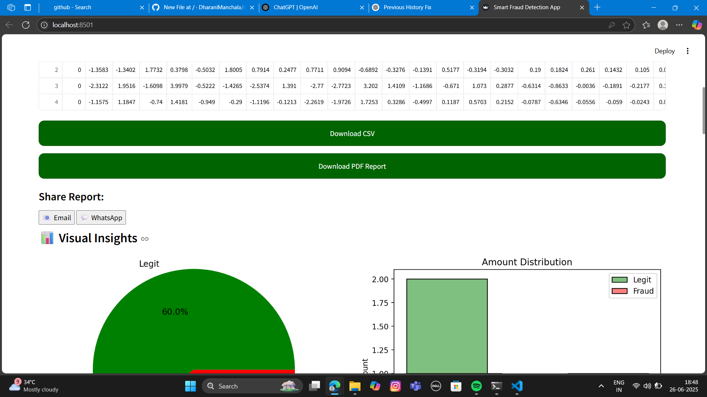
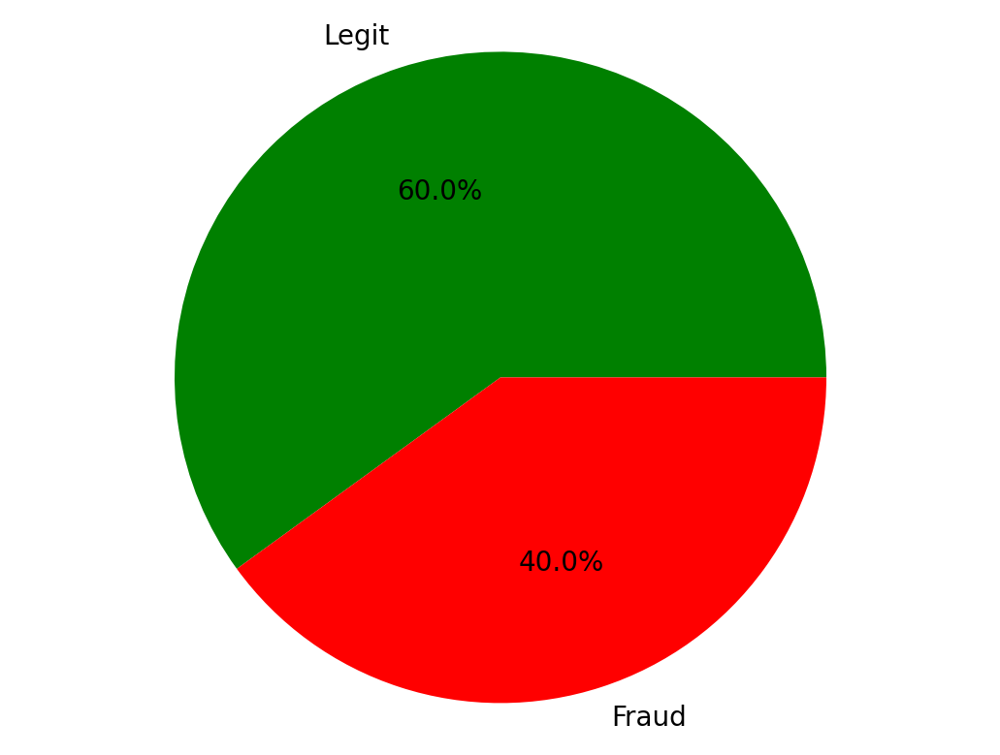
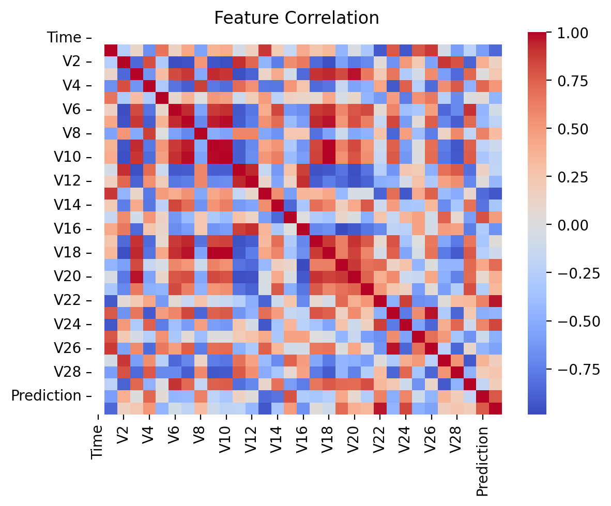
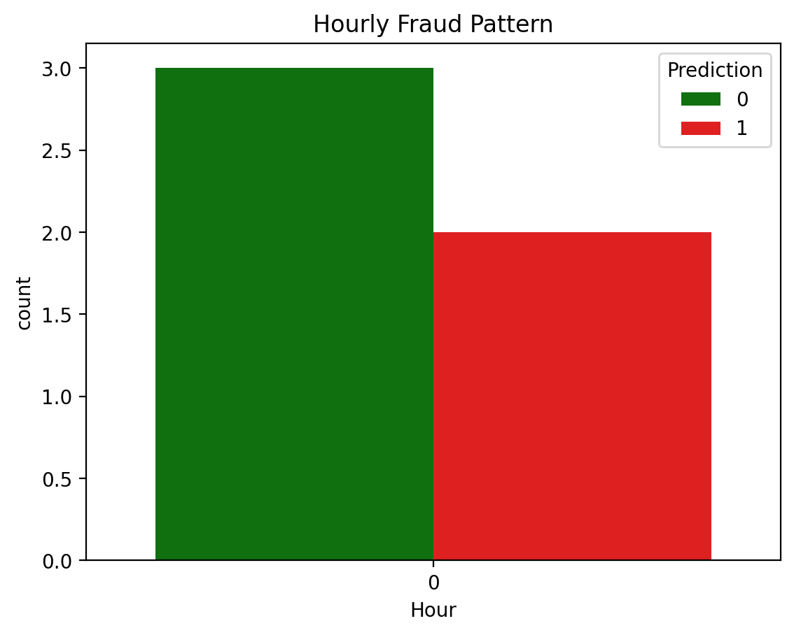
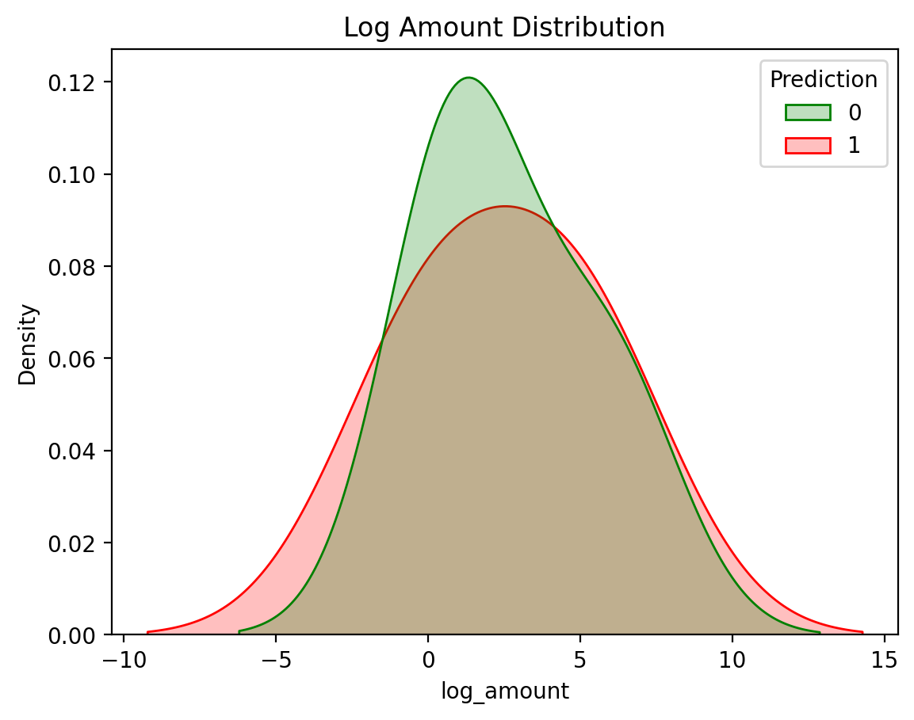

# 💳 Credit Card Fraud Detection App

This is a smart Streamlit web app that detects fraudulent credit card transactions using machine learning. It’s simple, user-friendly, and offers fraud pattern insights through beautiful visualizations.

🌐 **[Live App Deployment](https://dharanimanchala-credit-card-fraud-detector-app-oqe9n0.streamlit.app/)**

---

## 🚀 Features

- 🔐 User Sign Up & Login system
- 📁 Upload CSV of transactions
- 🎯 Detect fraud using pre-trained ML model
- 🔄 Adjustable fraud threshold slider
- 📊 Visual Insights: Pie, Histogram, Heatmap, KDE
- 📄 Export Results: Download CSV + PDF Report
- 🕒 Previous uploads history view
- 🧹 Clear all history with one click

---

## 📸 Screenshots

| Home Page | File Upload |
|-----------|-------------|
|  |  |

| Options Panel | Prediction Summary |
|---------------|--------------------|
|  |  |

| Correlation Heatmap | Hourly Fraud Pattern |
|---------------------|----------------------|
|  |  |

| Log Amount Distribution |
|--------------------------|
<td></td>

---

## ⚙️ Tech Stack

- **Frontend**: Streamlit
- **Backend**: Python
- **ML Model**: Scikit-learn
- **Visualizations**: Matplotlib, Seaborn
- **PDF Report**: FPDF

---

## 🧠 ML Model Info

- **Dataset**: [Kaggle Credit Card Fraud Detection](https://www.kaggle.com/datasets/mlg-ulb/creditcardfraud)
- **Features**: PCA-transformed features (V1–V28), Amount, Time
- **Scaling**: StandardScaler
- **Output**: Probability + binary prediction (1 = Fraud, 0 = Legit)

---

## 🧪 How to Run Locally

git clone https://github.com/DharaniManchala/credit-card-fraud-detector.git
cd credit-card-fraud-detector
pip install -r requirements.txt
streamlit run app.py

📁 Folder Structure

credit-card-fraud-detector/
├── app.py
├── requirements.txt
├── README.md
├── model/
│   ├── fraud_model.pkl
│   └── scaler.pkl
├── history/
├── Screenshots/
│   ├── Home.png
│   ├── Browse_File.png
│   ├── options.png
│   ├── Percentage.png
│   ├── Feature_Correlation.png
│   ├── Hourly_Fraud_Pattern.png
│   └── Log_Amount_Distribution.png

👤 Author
Dharani Manchala
📧 dharanimanchala@example.com
🔗 GitHub: DharaniManchala
🌐 Live App

⭐ If you like this project, give it a star on GitHub!

---

